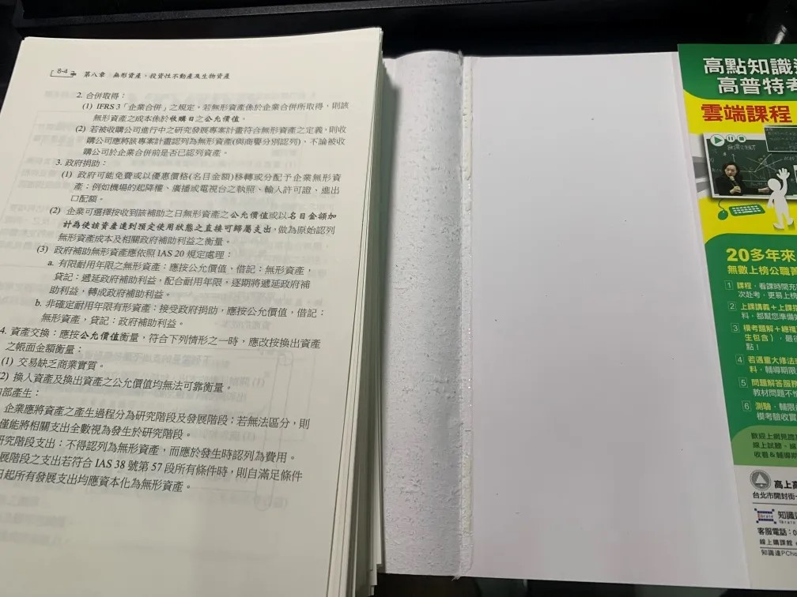

最近接到書本掃描的案例分享
案主是準備要準備國考的同學，因為平常除了上班外還有上課都要需要背許多書本，實在不方便
在網路上看到我的書本掃描電子化＋書本裝訂服務後便與我聯絡掃描的相關事宜

我收到書本後，是新的書本，檢查沒有破損後便開始拆書掃描

首先要仔細地把書皮拆開，補習班的課本在拆除時必須要特別的小心，因為補習班的課本書背特別地薄，很容易破損，一定要跟案主溝通，這個部分拆書會有破損的風險，但依照我的經驗很少有真的破損的狀況

